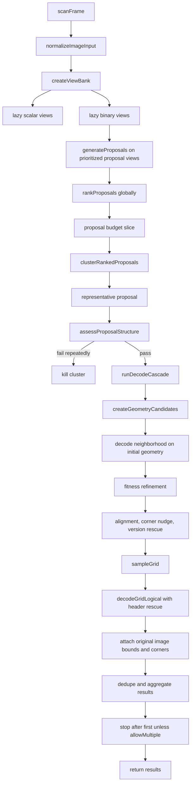

# ScanFrame End-to-End

Related: [[Pipeline Stage Contracts]], [[Ranked Proposal Pipeline]], [[Proposal Clusters]], [[Early Exit Heuristics]], [[View Study]], [[Diagnostics and Benchmark Boundary]]

## Scope
This note walks through the current `packages/ironqr` runtime path from a consumer calling `scanFrame(...)` to the final decoded output.

It focuses on the still-image/frame scanner, not streaming.

## Public API surface
Today the main entrypoints are:

```ts
scanFrame(input)                    -> Promise<readonly ScanResult[]>
scanFrame(input, { observability }) -> Promise<ScanReport>
scanFrameRanked(input, options?)    -> Promise<readonly RankedScanResult[]>
decodeGrid(input)                   -> Promise<DecodeGridResult>
```

`scanFrame()` is the main public consumer API.
Without observability it returns plain decoded results.
With `options.observability`, it returns a `ScanReport` envelope containing result-level and scan-level metadata.

`scanFrameRanked()` still exists as a legacy richer API that includes winning proposal metadata directly.

## Accepted input
`scanFrame(...)` accepts browser image sources plus a structural pixel buffer:

- `Blob`
- `File`
- `ImageBitmap`
- `ImageData`
- `{ width, height, data }`
- canvas / image / offscreen-canvas / video-frame sources

So a consumer calling `scanFrame()` with an image blob is a normal supported path.

---

## Bird's-eye flow

### ASCII flow

```text
scanFrame(input)
  |
  v
normalizeImageInput(input)
  |
  v
createViewBank(image)
  |
  +--> lazy scalar views      (gray, r, g, b, oklab-l, ±a, ±b)
  |
  +--> lazy binary views      (otsu / sauvola / hybrid) x (normal / inverted)
  |
  v
generateProposals() over prioritized proposal-view subset
  |
  v
rankProposals() globally
  |
  v
slice to proposal budget
  |
  v
clusterRankedProposals()
  |
  v
for each cluster representative:
  |
  +--> assessProposalStructure()   cheap QR plausibility gate
  |       |
  |       +--> fail enough times? kill cluster
  |
  +--> runDecodeCascade()
          |
          +--> createGeometryCandidates()
          +--> try decode neighborhood on initial geometry
          +--> refine by fitness
          +--> rescue: alignment refit / corner nudges / version neighborhood
          +--> sample logical grid
          +--> QR-spec decode with header rescue
          +--> success? attach original-image bounds/corners
  |
  v
dedupe successful results
  |
  +--> stop after first unless allowMultiple === true
  |
  v
return ScanResult[] or ScanReport
```

### Mermaid



---

## Step-by-step

## 1. Public boundary
`scanFrame()` runs one internal Effect-backed scan implementation.

That public boundary has two modes:
- without `observability`: return plain `ScanResult[]`
- with `observability`: return `ScanReport`

`scanFrameRanked()` uses the same ranked internal scan, but returns the legacy winning-path metadata shape directly.

## 2. Input normalization
The first real stage is `normalizeImageInput(input)`.

This stage:

1. converts the input into pixel-backed image data
2. validates the trust boundary
3. constructs the canonical `NormalizedImage`

Validation rules:
- width and height must be positive integers
- data must be `Uint8ClampedArray`
- data length must equal `width * height * 4`

The normalized image contains:
- `width`
- `height`
- `rgbaPixels`
- lazy `derivedViews` caches for scalar views, binary views, and OKLab planes

## 3. Lazy view bank creation
The scanner builds a `ViewBank` around the normalized image.

Important property: views are **lazy**.
Nothing is materialized until later stages actually request it.

### Scalar views
The bank can materialize these scalar planes:
- `gray`
- `r`, `g`, `b`
- `oklab-l`
- `oklab+a`, `oklab-a`
- `oklab+b`, `oklab-b`

### Binary views
Each scalar view can be thresholded with:
- `otsu`
- `sauvola`
- `hybrid`

and each thresholded view can be used as:
- `normal`
- `inverted`

That gives a total of 54 possible binary views.

### Alpha handling
RGB and grayscale views are alpha-composited onto white before conversion, matching how transparent artwork is visually rendered.

## 4. Proposal-generation fast path
Proposal generation does not scan all 54 binary views by default.

Instead, it uses a prioritized proposal-generation subset.
The current fast path is the empirically chosen top-18 binary-view list.

Examples from the current ordered subset:
1. `gray:otsu:normal`
2. `oklab-l:hybrid:normal`
3. `gray:sauvola:normal`
4. `oklab-l:sauvola:normal`
...
17. `gray:hybrid:inverted`
18. `gray:otsu:inverted`

This is a proposal-generation policy, not a full decode-neighborhood policy.

## 5. Proposal generation
`generateProposals(...)` iterates the prioritized proposal views.

For each binary view it:
1. runs row-scan finder detection
2. optionally runs more expensive detectors such as flood / matcher
3. dedupes finder evidence
4. builds plausible finder triples
5. estimates candidate QR versions
6. emits one or more proposals

Proposal kinds currently include:
- `finder-triple`
- `quad`

The result of this stage is a global pool of QR candidate explanations, not a winner.

## 6. Global proposal ranking
`rankProposals(...)` scores and sorts all proposals globally.

Current score components include:
- detector confidence / source prior
- geometry plausibility
- quiet-zone support
- timing-pattern plausibility
- alignment support
- penalties for bad geometry / off-image behavior

This is one of the core architectural changes:
`ironqr` no longer behaves like a threshold loop.
It builds many candidates, then spends expensive work on the best ones first.

## 7. Proposal budget
After ranking, the scanner truncates the proposal list to a bounded global budget.

Current default global proposal budget:
- `24`

There is also a per-view generation cap.
Current default per-view proposal cap:
- `12`

These are separate:
- per-view generation cap
- global ranked-proposal spend cap

## 8. Proposal clustering
The bounded ranked proposals are clustered before expensive decode work.

The point of clustering is to collapse near-duplicate rediscoveries of the same physical QR candidate.

Current cluster key is coarse and based on:
- estimated version
- quantized centroid
- quantized width / height

Each cluster keeps a small representative set.
Current default representative budget:
- `3`

Representative selection prefers:
1. the best-ranked proposal
2. new view families
3. unseen threshold/polarity profiles
4. then next-best proposals

So the expensive spend unit becomes a small set of representative candidates per likely QR, not every ranked proposal independently.

## 9. Cheap structural screen
Before a representative gets the full decode cascade, the scanner runs `assessProposalStructure(...)`.

This stage is a cheap QR plausibility gate.

It:
1. creates a few cheap geometry candidates
2. samples a coarse logical grid on the source binary view
3. measures:
   - timing support
   - finder support
   - separator support
   - module-pitch smoothness

If the candidate looks structurally implausible, it does not get the full decode budget.

Current cluster kill rule:
- if a cluster accumulates repeated structural failures before a success, the cluster is killed
- current threshold is `3` structural failures

## 10. Decode cascade
For a surviving representative, `runDecodeCascade(...)` performs the expensive search.

Search order is roughly:
1. initial geometry + source/decode-neighborhood views
2. fitness refinement
3. alignment-assisted refit
4. corner nudges
5. version-neighborhood rescue
6. version-neighborhood + fitness refinement

Inside each decode attempt, `decodeGridLogical(...)` now also performs limited header rescue when the sampled grid is close but noisy:
- ranked near-miss format-info candidates after strict BCH decode fails
- size-implied and nearby version candidates when version bits are noisy or inconsistent

This is proposal-local search: once a promising proposal survives screening, the scanner spends most of its budget trying to make that proposal decode before dropping to weaker candidates.

## 11. Geometry candidates
The decode cascade begins by creating geometry candidates.

A geometry candidate carries:
- QR version
- module size (`size`)
- homography
- image-space corners
- image-space bounds
- source proposal id
- source binary view id
- geometry mode
- geometry score

Current geometry modes include:
- `finder-homography`
- `center-homography`
- `quad-homography`

## 12. Off-image rejection
Before expensive decode work, geometry is rejected if key projected points fall outside the source image.

That includes:
- the four QR corners
- the QR center
- alignment anchor for version 2+

This prevents the scanner from spending rescue budget on obviously impossible projected QR placements.

## 13. Decode neighborhood
The scanner does not decode only on the proposal's source binary view.

Instead, it builds a **decode neighborhood** ordered by similarity to the proposal view.

High-level ordering:
- exact same view first
- same scalar + same polarity
- same scalar
- same family + same polarity
- same threshold + same polarity
- same family
- then more distant views

This matters because:
- one view may localize a QR best
- a nearby different view may decode it best

Proposal-view ordering and decode-neighborhood ordering are related, but not the same thing.

## 14. One concrete decode attempt
Inside the decode cascade, a concrete attempt is effectively:

```text
proposal x geometry x decode-view x sampler x refinement-mode
```

For each attempt, the scanner:
1. emits a `decode-attempt-started` trace event if tracing is enabled
2. samples a logical QR grid
3. runs a cheap timing-pattern gate
4. if timing passes, runs strict QR decode
5. on success, returns a `ScanResult` with original-image geometry attached

## 15. Samplers
Current samplers are:
- `cross-vote` — default
- `dense-vote`
- `nearest`

Roles:
- `cross-vote`: robust default for rounded / dotted / slightly misregistered modules
- `dense-vote`: stronger rescue voting pattern
- `nearest`: sharper fallback when vote samplers blur tiny or hard-thresholded modules

## 16. Timing gate
Before attempting strict QR decode, the sampled logical grid must pass a timing-pattern plausibility check.

If timing looks implausible, the attempt fails early without running the full QR-spec decode.

This is a decode-attempt-level gate, separate from the earlier representative-level structural screen.

## 17. Strict QR decode
If timing passes, the scanner runs `decodeGridLogical(...)`.

This stage is the QR-spec decoder.
It handles:
- format info
- version info
- masking
- Reed-Solomon correction
- payload extraction
- segment decoding

The decode path also includes narrowly targeted header rescue for near-miss grids:
- ranked format-info candidates beyond the strict BCH winner
- size-implied and nearby version candidates when version bits are too noisy to trust directly
- mirrored decode variants before finally giving up

This keeps the rescue local to spec-adjacent header interpretation instead of pushing more localization heuristics into the decoder.

## 18. Attach original-image geometry
On a successful decode, the pipeline overwrites the decoder's grid-local placeholder geometry with the winning geometry candidate's image-space values.

That means the final public result contains original-image coordinates for:
- `bounds`
- `corners.topLeft`
- `corners.topRight`
- `corners.bottomRight`
- `corners.bottomLeft`

So yes: the returned corners are in the coordinate system of the original input image.

## 19. Result aggregation
Successful results are deduped before returning.

Default stop rule:
- stop after first success

Multi-code mode:
- continue if `allowMultiple === true`

So `scanFrame()` is single-result-first by default, but can continue scanning when the caller opts into multiple results.

---

## What comes out today?

## `scanFrame()` / `scanImage()` without observability
Without `observability`, `scanFrame()` returns `ScanResult[]`.

Current public `ScanResult` includes:
- `payload.kind`
- `payload.text`
- `payload.bytes`
- `confidence`
- `version`
- `errorCorrectionLevel`
- `bounds`
- `corners`
- `headers`
- `segments`

### Included today
- decoded payload text / bytes
- payload kind guess
- QR version and EC level
- original-image bounds
- original-image corners
- decoded headers and segments

### Not included today
- raw finder evidence
- detector family details beyond the plain result
- source proposal id
- source binary view
- decode binary view
- sampler used
- refinement path
- cluster history
- trace events

## `scanFrame()` / `scanImage()` with observability
When `observability` is present, `scanFrame()` returns a `ScanReport` envelope:

- `results`: decoded results plus requested result-level metadata
- `scan`: requested scan-level metadata, including zero-result diagnostics and proposal-generation summaries

Currently supported observability families include:
- result `path`
- result `attempts`
- scan `views`
- scan `proposals`
- scan `failure`
- scan `timings`
- trace `events`

This is now the preferred way to ask for path-to-result metadata and scan observability.

## `scanFrameRanked()`
`scanFrameRanked()` still returns `RankedScanResult[]`.

That includes:
- `result: ScanResult`
- `proposalId`
- `proposalKind`
- `score`
- `scoreBreakdown`
- `binaryViewId` (proposal-generation source view)
- `detectorSources`
- `decodeAttempt`

The successful `decodeAttempt` includes:
- `proposalId`
- `geometryCandidateId`
- `decodeBinaryViewId`
- `sampler`
- `refinement`

This legacy helper still exposes the winning path, but it is no longer the only route to richer metadata.

---

## Observability today

## Current mechanism
Observability is currently exposed through two layers:
- public `observability` options on `scanFrame()` / `scanImage()`
- lower-level tracing via `traceSink`, `createTraceCollector()`, and `createTraceCounter()`

There is still **not** a public `verbose: true` contract.

## What tracing can tell you
Current typed trace events can report:
- scan started / finished
- scalar views built
- binary views built
- proposals generated
- proposals ranked
- proposal clusters built
- cluster started / finished
- representative processing started
- proposal structure assessed
- geometry candidates created
- decode attempts started / failed / succeeded

So if you want to know:
- which views were actually materialized
- which binary view generated the winning proposal
- which decode view actually succeeded
- which sampler and refinement mode won
- how many clusters were processed
- which failure types dominated

...the current way to get that is tracing.

## What tracing does not yet expose as part of the return value
Even with the current trace model, the public return contracts do not yet include by default:
- raw finder coordinates
- full finder evidence objects
- every internal scoring/detail bucket

Those are still internal or trace-level concerns unless requested through explicit observability features.

---

## Is finder / observability stuff part of the output schema yet?

## Finder data
Not in plain `ScanResult`.
Not fully in `RankedScanResult` either.

Current status:
- `ScanResult`: final public decode only
- `ScanReport`: requested result-level and scan-level metadata
- `RankedScanResult`: legacy winning proposal metadata + winning decode-attempt metadata
- raw finder evidence: still internal

## Observability
Yes, now through both the plain API and tracing.

Today the effective layers are:

### Plain result layer
`scanFrame()` without `observability`
- final answer only

### Observability envelope layer
`scanFrame()` with `observability`
- final answer plus requested result-level and scan-level metadata

### Legacy winning-path layer
`scanFrameRanked()`
- final answer plus winning proposal / decode metadata in the old ranked shape

### Diagnostic trace layer
`traceSink`
- detailed typed event stream about the work that was done

That is the current contract split.

---

## Should this become `verbose: true`?
Probably not.

`verbose: true` is too vague.
It does not clearly say whether it changes:
- output shape
- logging
- trace collection cost
- or all of the above

The current direction is better: explicit observability families such as:

```ts
observability: {
  result: { path: 'basic', attempts: 'summary' },
  scan: { proposals: 'summary', timings: 'full', failure: 'summary' },
  trace: { events: 'summary' },
}
```

That preserves separate knobs for:
- returned metadata shape
- scan-level diagnostics
- raw trace-event collection

---

## Summary
Compressed to one sentence:

> `ironqr` turns an image into a lazy bank of scalar and binary views, generates and globally ranks QR proposals across a prioritized proposal-view subset, clusters near-duplicates, cheaply screens representative candidates for QR-lattice plausibility, then spends a rank-sensitive decode cascade across geometry refinements and decode neighborhoods until one candidate decodes and yields original-image bounds and corners.

## Practical answer
If a consumer calls `scanFrame(blob)` today, they get:
- decoded payload data
- confidence / version / EC level
- original-image bounds
- original-image corners

If they call `scanFrame(blob, { observability: ... })`, they can additionally get:
- winning path metadata
- attempt summaries or full attempt lists
- view materialization summaries
- proposal-generation summaries by binary view
- failure summaries for zero-result scans
- timing summaries or full per-attempt timings
- optional trace summaries or full trace events

If they call `scanFrameRanked(blob)`, they additionally get the legacy winning-path shape.

If they also pass a trace sink, they can observe:
- which views were materialized
- what proposals and clusters were processed
- which attempts failed
- which attempt succeeded

What they do **not** get as part of the plain public output contract yet:
- raw finder coordinates
- raw finder evidence objects
- every internal scoring/detail bucket by default
- a `verbose: true` API surface
